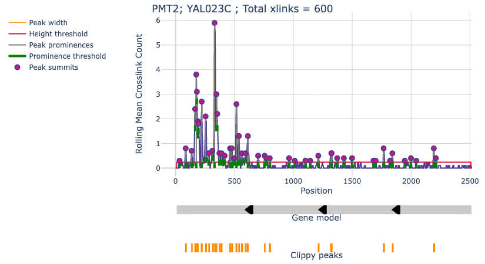
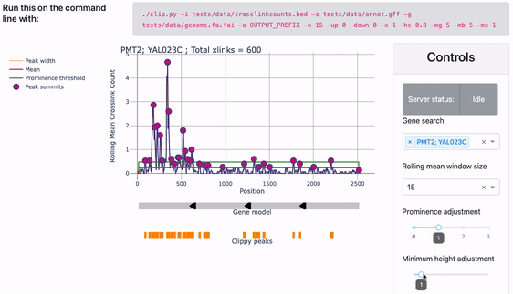

# Clippy - Interactive, intuitive peak calling for CLIP data

A wrapper around scipy "[find_peaks](https://docs.scipy.org/doc/scipy/reference/generated/scipy.signal.find_peaks.html)" function to enable peak calling of CLIP data.


## Concept

Using the annotation provided, crosslinks over each gene are smoothed using a rolling mean. The window can be decided by the user. For each gene the mean of the smoothed signal is taken (red line) and the mean + (mean * adjustment factor) (green line) is taken. The mean is used to define the minimum height of a peak. The mean + (mean * adjustment factor) is taken to define the minimum prominence of a peak. Please see [here](https://en.wikipedia.org/wiki/Topographic_prominence#:~:text=The%20prominence%20of%20a%20peak,or%20key%20saddle%2C%20or%20linking) for the definition of topographical prominence. Essentially this parameter limits shallow peaks being called in regions where there is a clearly more prominent peak. 

In the image below, you can see the positions the algorithm picks out in this gene as peaks.



Clippy also has an interactive mode, allowing users to tune the parameters to their protein of interest.



## Installation

Clippy is now available to install from Bioconda:
```
conda create --name clippy python=3.8
conda activate clippy
conda install -c bioconda -c conda-forge clippy 
```

## Run test data

To start the interactive parameter search server for the test yeast data, run:

```
clippy --input_bed tests/data/crosslinkcounts.bed --output_prefix OUTPUT_PREFIX \
       --annotation tests/data/annot.gff --genome_file tests/data/genome.fa.fai
```

## Usage

```
usage: clippy [-h] [-v] -i INPUT_BED -o OUTPUT_PREFIX -a ANNOTATION -g GENOME_FILE
              [-n [WINDOW_SIZE]] [-w [WIDTH]] [-x [MIN_PROM_ADJUST]] [-mx [MIN_HEIGHT_ADJUST]]
              [-mg [MIN_GENE_COUNTS]] [-mb [MIN_PEAK_COUNTS]] [-alt [ALT_FEATURES]]
              [-up [UPSTREAM_EXTENSION]] [-down [DOWNSTREAM_EXTENSION]] [-nei]
              [-inter [INTERGENIC_PEAK_THRESHOLD]] [-t [THREADS]] [-cf [CHUNKSIZE_FACTOR]] [-int]

Call CLIP peaks.

required arguments:
  -i INPUT_BED, --input_bed INPUT_BED
                        bed file containing cDNA counts at each crosslink position
  -o OUTPUT_PREFIX, --output_prefix OUTPUT_PREFIX
                        prefix for output files
  -a ANNOTATION, --annotation ANNOTATION
                        gtf annotation file
  -g GENOME_FILE, --genome_file GENOME_FILE
                        genome file containing chromosome lengths. Also known as a FASTA index
                        file, which usually ends in .fai. This file is used by BEDTools for
                        genomic operations

optional peak size arguments:
  Control the size of the peaks called

  -n [WINDOW_SIZE], --window_size [WINDOW_SIZE]
                        rolling mean window size [DEFAULT 10]
  -w [WIDTH], --width [WIDTH]
                        proportion of prominence to calculate peak widths at. Smaller values will
                        give narrow peaks and large values will give wider peaks [DEFAULT 0.4]

optional peak filtering arguments:
  Control how peaks are filtered

  -x [MIN_PROM_ADJUST], --min_prom_adjust [MIN_PROM_ADJUST]
                        adjustment for minimum prominence threshold, calculated as this value
                        multiplied by the mean [DEFAULT 1.0]
  -mx [MIN_HEIGHT_ADJUST], --min_height_adjust [MIN_HEIGHT_ADJUST]
                        adjustment for the minimum height threshold, calculated as this value
                        multiplied by the mean [DEFAULT 1.0]
  -mg [MIN_GENE_COUNTS], --min_gene_counts [MIN_GENE_COUNTS]
                        minimum cDNA counts per gene to look for peaks [DEFAULT 5]
  -mb [MIN_PEAK_COUNTS], --min_peak_counts [MIN_PEAK_COUNTS]
                        minimum cDNA counts per broad peak [DEFAULT 5]

optional annotation arguments:
  Control how the gene annotation is interpreted and used

  -alt [ALT_FEATURES], --alt_features [ALT_FEATURES]
                        A list of alternative GTF features to set individual thresholds on in the
                        comma-separated format <alt_feature_name>-<gtf_key>-<search_pattern>
  -up [UPSTREAM_EXTENSION], --upstream_extension [UPSTREAM_EXTENSION]
                        upstream extension added to gene models [DEFAULT 0]
  -down [DOWNSTREAM_EXTENSION], --downstream_extension [DOWNSTREAM_EXTENSION]
                        downstream extension added to gene models [DEFAULT 0]
  -nei, --no_exon_info  Turn off individual exon and intron thresholds
  -inter [INTERGENIC_PEAK_THRESHOLD], --intergenic_peak_threshold [INTERGENIC_PEAK_THRESHOLD]
                        Intergenic peaks are called by first creating intergenic regions and
                        calling peaks on the regions as though they were genes. The regions are
                        made by expanding intergenic crosslinks and merging the result. This
                        parameter is the threshold number of summed cDNA counts required to
                        include a region. If set to zero, the default, no intergenic peaks will
                        be called. When using this mode, the intergenic regions used will be
                        output as a GTF file. [DEFAULT 0]

optional arguments:
  -h, --help            show this help message and exit
  -v, --version         show program's version number and exit
  -t [THREADS], --threads [THREADS]
                        number of threads to use. [DEFAULT 1]
  -cf [CHUNKSIZE_FACTOR], --chunksize_factor [CHUNKSIZE_FACTOR]
                        A factor used to control the number of jobs given to a thread at a time.
                        A larger number reduces the number of jobs per chunk. Only increase if
                        you experience crashes [DEFAULT 16]
  -int, --interactive   starts a Dash server to allow for interactive parameter tuning
```

*A note on annotation gff*

The code only requires that you have a feature labelled "gene" in the 3rd column of your gff, and assumes that the 9th column of your gff will uniquely identify your genes and contain some kind of gene name or ID.

## Developer Functions

If you plan to contribute to the Clippy code we have some helpful functions for development. To run the automated testing, use:

```
pytest --cov=clip -k "not profiling and not web"
```

You might be interested in how long certain functions take to run. To run the profiling code:

```
pytest -k profiling --profile-svg
python -m gprof2dot -f pstats prof/get_the_peaks.out | dot -Tpdf -o prof/get_the_peaks.pdf
```

### Test data generation

Test data for the automated testing was generated as follows.

For CEP295 data:

```
cat tests/data/gencode.v38.annotation.gtf | \
    awk '{if($1=="chr11" && 93661682<=$4 && $5<=93730358){print($0)}}' > \
    tests/data/gencode.v38.cep295.gtf

gunzip -c tests/data/tardbp-egfp-hek293-2-20201021-ju_mapped_to_genome_reads_single.bed.gz | \
    awk '{if($1=="chr11" && 93661682<=$2 && $3<=93730358){print($0)}}' > tests/data/cep295.bed
```

For RBFOX2 data:

```
cat tests/data/gencode.v38.annotation.gtf | \
    awk '{if($1=="chr19" && 10000000<=$4 && $5<=11000000){print($0)}}' > \
    tests/data/gencode.v38.chr19_10M_11M.gtf

gunzip -c tests/data/HepG2_RBFOX2.xl.bed.gz | \
    awk '{if($1=="chr19" && 10000000<=$2 && $3<=11000000){print($0)}}' > \
    tests/data/rbfox2_chr19_10M_11M.bed
```

## Authors

Charlotte Capitanchik - charlotte.capitanchik@crick.ac.uk

Marc Jones - marc.jones@crick.ac.uk
