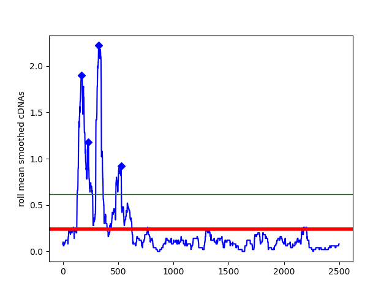

# clippy
A wrapper around scipy "find_peaks" function to enable peak calling of CLIP data.


### Requirements
This is a python 3 program requiring the following modules:
 - numpy
 - scipy
 - pybedtools
 - pandas
 - matplotlib


### Usage
```
get_peaks.py -i <input-bed-counts> -o <output-file-prefix> -a <annotation-gtf> \
[optional... -n <rolling-mean-window> -x <adjust-prominence> -m <min-gene-count>]
```

### Concept
Using the annotation provided, crosslinks over each gene are smoothed using a rolling mean. The window can be decided by the user. For each gene the mean of the smoothed signal is taken (red line) and the mean + (standard deviation * adjustment factor) (green line) is taken. The mean is used to define the minimum height of a peak. The mean + (standard deviation * adjustment factor) is taken to define the minimum prominence of a peak. Please see [here](https://en.wikipedia.org/wiki/Topographic_prominence#:~:text=The%20prominence%20of%20a%20peak,or%20key%20saddle%2C%20or%20linking) for the definition of topographical prominence. Essentially this parameter allows that we do not call many shallow peaks in a region where there is a clearly more prominent peak. 

In the image below, you can see the four positions the algorithm picks out in this gene as peaks. To get broader windows we take these single nt positions and merge adjacent crosslinks.


